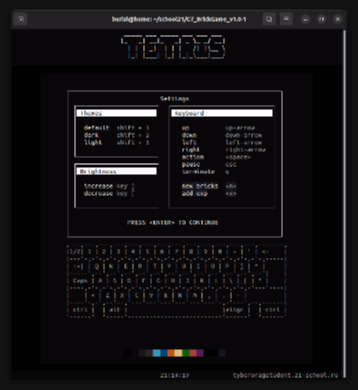
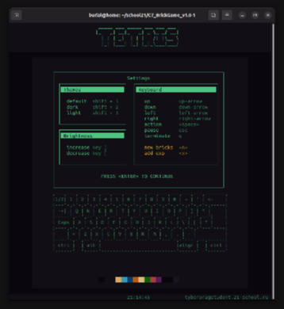
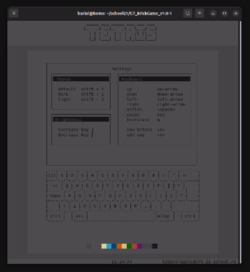
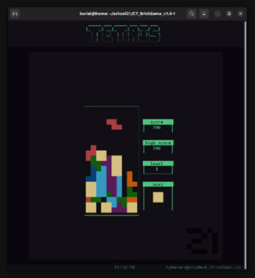

## Build

*ensure that u have ncurses libs*

```sh
    make && ./tetris
```

## Install

```sh
make install 
# install location
$ which tetris
/usr/local/bin/tetris
```
*now u can run it from any places*
